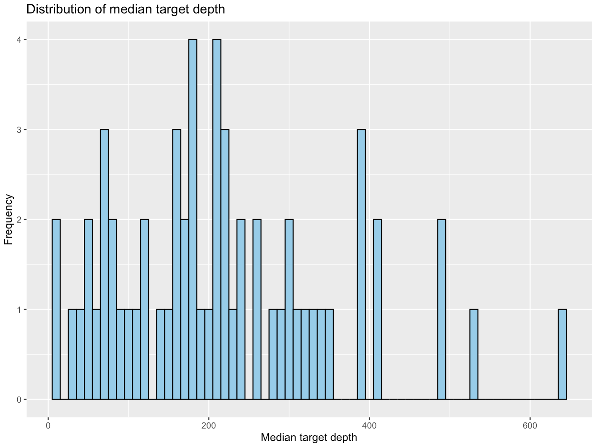
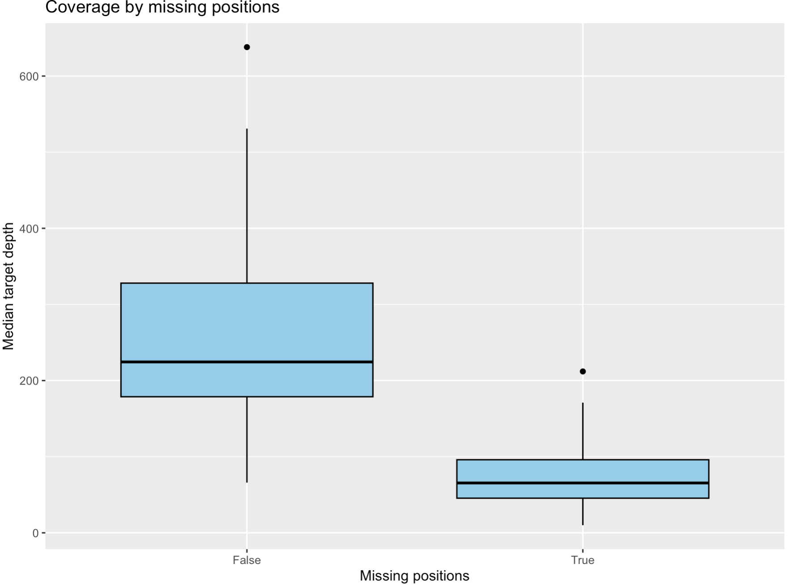
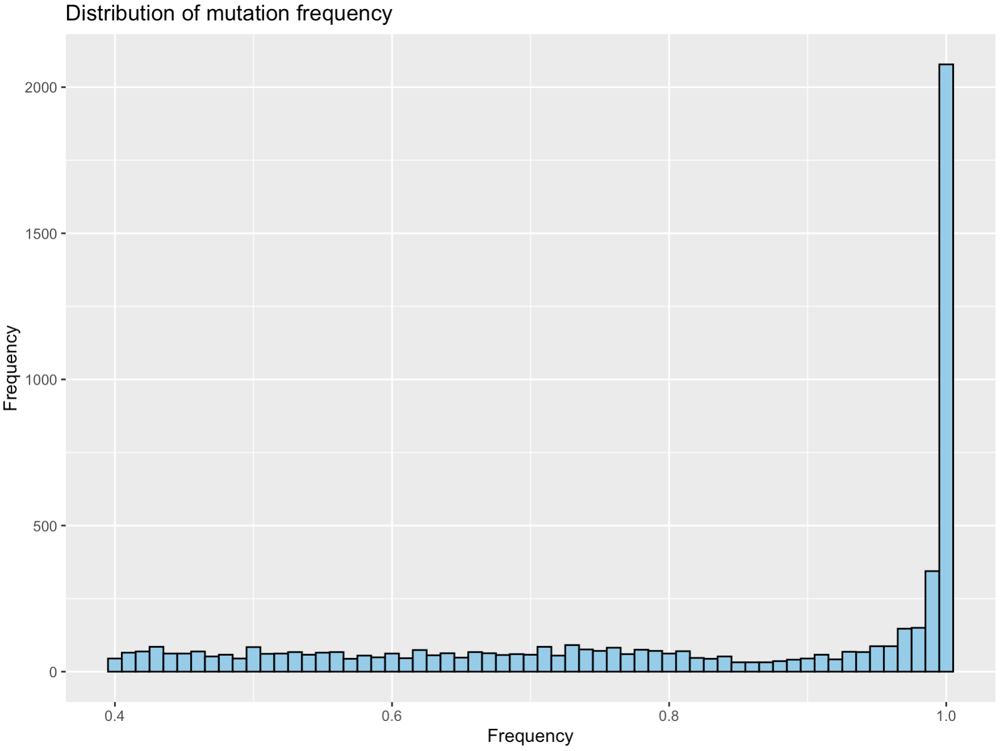
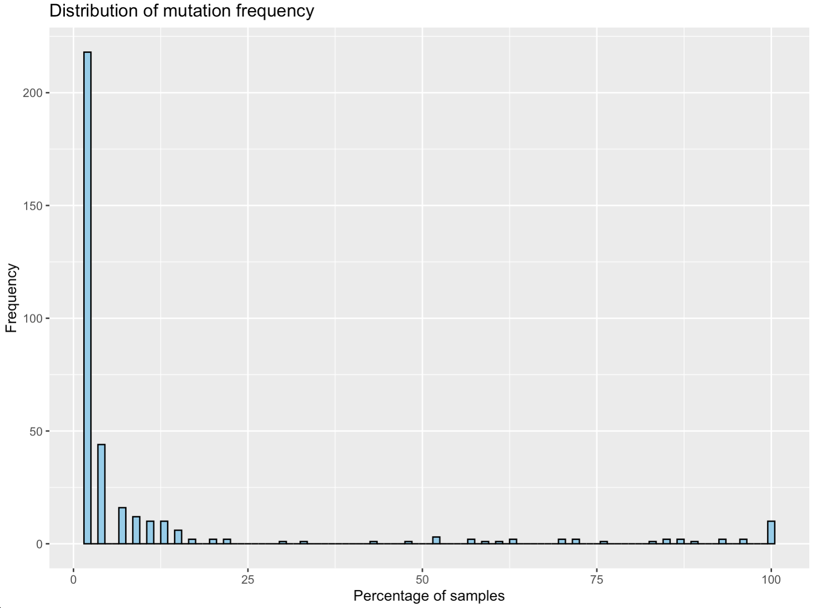
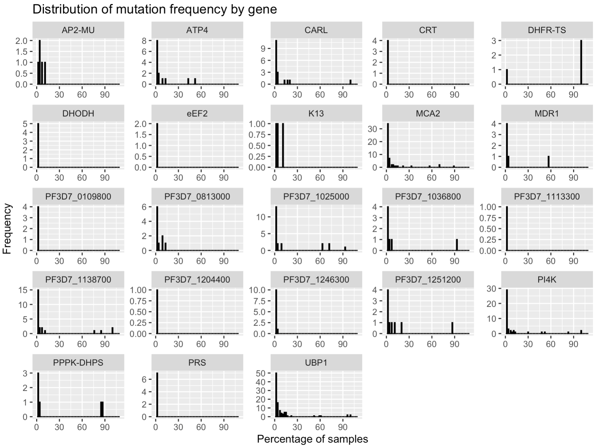

# Malaria genomics learning

This is a collection of resources for learning about malaria genomics. It is intended for researchers who are new to the field and want to learn more about the genomics of malaria parasites.

## Introduction

Malaria is a disease caused by parasites of the genus _Plasmodium_. The most severe form of malaria is caused by _Plasmodium falciparum_, which is responsible for the majority of malaria-related deaths. Malaria is transmitted to humans through the bites of infected mosquitoes. The parasites then multiply in the liver and red blood cells, leading to the symptoms of the disease. One of the major challenges in treating malaria is the emergence of drug resistance. This is particularly problematic in the case of _P. falciparum_, which has developed resistance to multiple antimalarial drugs. Detecting drug resistance mutations in the parasite's genome can help guide treatment decisions and prevent the spread of resistance.

## Learning objectives

By the end of this course, you will be able to:

* Use the command line to run malaria-profiler on next-generation sequencing data of _P. falciparum_ isolates
* Analyse the results of a malaria-profiler run to identify drug resistance mutations
* Use pyMoi to characterise the polygenomic patterns of _P. falciparum_ isolates


## Dataset

We will be using data from a study that sequenced the genomes of _P. falciparum_ isolates from Mozambique. The dataset consists of whole-genome sequencing data for multiple isolates collected from different regions of the country. We will use this data to identify genetic variants associated with drug resistance and population structure in the parasite population. Have a look at the paper [here](https://www.nature.com/articles/s42003-023-04997-7). To reduce the size of the dataset, we will focus on a subset of isolates. We have also reduced the amount of data (taking only reads overlapping drug resistance genes and some other key regions) for each isolate to make the analysis more manageable. The dataset is available for download [here](https://example.com/malaria_genomics_data.zip). 

!!! important
    Bioinformatics takes time! There will be several times during the practical where you will be waiting for commands to finish running. This is normal and part of the process. If you have any questions or need help, please ask the instructors. This is also a good oppurtunity to find out more about how the data was generated. While you are waiting for commands to finish, you can read the paper linked above to learn more about the study.

## Malaria-Profiler

Malaria-Profiler is a user-friendly tool that can rapidly and accurately predict the geographical regional source and anti-malarial drug resistance profiles across large numbers of samples with WGS data. The software is flexible with modifiable bioinformatic pipelines. For example, it is possible to select the sequencing platform, display specific variants, and customise the format of outputs. With the increasing application of next-generation sequencing platforms on Plasmodium DNA, Malaria-Profiler has the potential to be integrated into point-of-care and surveillance settings, thereby assisting malaria control. Malaria-Profiler is available online (https://bioinformatics.lshtm.ac.uk/malaria-profiler) and as standalone software (https://github.com/jodyphelan/malaria-profiler). We will be using the standalone version for this course.

First we need to get the data that we will be using for this practical.

```
git clone https://github.com/jodyphelan/malaria-demo-data.git
```

After the command has finished running, please move in to the folder you just downloaded. You will now have several input files we will use during the practical. This includes:

* Fastq files
* Pre-generated result files

We will then need to install malaria-profiler. We can do this by first creating a conda environment that will contain all requred software. We can do this with conda by downloading all the prerequiste dependancies. We have prepared a file that contains all this information which conda will be able to read and create the environment for you.

```
conda create --file data_files/conda_env.txt --name malaria-profiler
```

Now that we have all the dependancies installed we will need to install malaria-profiler. We can use the python package manager `pip` to download the latest version of malaria-profiler from GitHub and install into our new environment. Remember to first activate the environment before running the install command:

```
conda activate malaria-profiler
```

We can now install the pathogen-profiler and malaria-profiler tools from GitHub:

```
pip install --force-reinstall git+https://github.com/jodyphelan/pathogen-profiler.git@dev
pip install --force-reinstall git+https://github.com/jodyphelan/malaria-profiler.git@dev
```

Check the installation has run correctly by typing in the following into your terminal:

```
malaria-profiler --help
```

You should see the following text:

!!! terminal
    ```
    Usage: malaria-profiler [-h] [--version] [--no_cleanup] [--logging {DEBUG,INFO,WARNING,ERROR,CRITICAL}] {profile,collate,update_db,create_resistance_db,create_species_db,list_db} ...

    malaria-profiler pipeline

    Positional Arguments:
    {profile,collate,update_db,create_resistance_db,create_species_db,list_db}
                            Task to perform
        profile             Run whole profiling pipeline
        collate             Collate results form multiple samples together
        update_db           Update all databases
        create_resistance_db
                            Generate the files required to run resistance profiling with malaria-profiler
        create_species_db   Generate the files required to run speciation with malaria-profiler
        list_db             List loaded databases

    Options:
    -h, --help            show this help message and exit
    --version             show program's version number and exit
    --no_cleanup          Don't remove temporary files on error (default: False)
    --logging {DEBUG,INFO,WARNING,ERROR,CRITICAL}
                            Logging level (default: info)       
    ```

You should see several subcommands that you can run with malaria-profiler. For example, we will be using the `profile` subcommand to analyze the genomes of the _P. falciparum_ isolates in our dataset. If you want to learn more about the options available for a specific subcommand, you can run `malaria-profiler <subcommand> --help`. For example, to learn more about the options available for the `profile` subcommand, you can run `malaria-profiler profile --help`.


Finally, we need to download the latest databases that malaria-profiler will use. These include reference genomes, mutation lists and machine learning models of geographic prediction. You can do this running the following command:

```
malaria-profiler update_db
```

To see the latest versions of databases that you have, use the `list_db` subcommand. 

!!! question
    Which species can malaria-profiler analyse?


Let's first see how to run malaria-profiler. Move into the directory called `results`, this is where we will generate our results. First let's see how many fastq files we have. There are two fastq files for each sample, representing the forward and reverse reads. We have a total of 9 samples, so we should have 18 fastq files in total. We can check this by running the following command:

```
ls ../fastq/ | wc -l
```

To make the analysis faster, we have subset the fastqs to only contain reads overlapping drug resistance genes and other important regions of the genome used by malaria-profiler. We can see the regions that are included in the fastq files by looking at the `regions.bed` file. This file contains the coordinates of the regions that were extracted from the full genome. We can look at the first few lines of this file by running the following command:

```
head ../data_files/regions.bed
```

You should see something like this:

!!! terminal
    ```
    Pf3D7_01_v3	190069	201430
    Pf3D7_01_v3	380497	382624
    Pf3D7_01_v3	489336	489337
    Pf3D7_02_v3	305437	305438
    Pf3D7_02_v3	367270	367271
    Pf3D7_02_v3	375426	375427
    Pf3D7_03_v3	221112	223145
    Pf3D7_03_v3	383168	383169
    Pf3D7_03_v3	617425	617426
    Pf3D7_03_v3	619608	619609
    ```

Next, we will run malaria-profiler on the fastq files to profile the _P. falciparum_ isolates. We will use the `profile` subcommand of malaria-profiler to do this. The `profile` subcommand takes as input the fastq files for each sample and the regions.bed file. It will then align the reads to the reference genome, call variants, and predict drug resistance and geographic origin. We will also specify the output directory where the results will be saved. We can run the following command to profile the isolate with the accession code SRR22672119:

```
malaria-profiler profile -1 ../fastq/SRR22672119_1.fq.gz -2 ../fastq/SRR22672119_2.fq.gz -p SRR22672119 --resistance_db falciparum --txt -t 4
```

There are a few important parameters that you'll notice in the command above:

* `-1` and `-2` specify the paths to the forward and reverse fastq files for the sample
* `-p` specifies the prefix to use for the output files
* `--resistance_db` specifies the database to use for drug resistance prediction. In this case, we are using the `falciparum` database, which contains information about drug resistance mutations in _P. falciparum_.
* `--txt` specifies that we want the results in text format. By default, the results are saved in JSON format.
* `-t` specifies the number of threads to use for the analysis. We are using 4 threads in this case (if you have access to more you can increase this number to speed up the analysis).

After running the command, you should have the following files:

* `SRR22672119.bam`: The aligned reads in BAM format
* `SRR22672119.bam.bai`: The index file for the aligned reads
* `SRR22672119.results.json`: The results of the profiling analysis in JSON format
* `SRR22672119.results.txt`: The results of the profiling analysis in text format

You can view the results in the text file by running the following command:

```
cat SRR22672119.results.txt
```

!!! question
    What is the predicted geographic origin of the isolate with the accession code SRR22672119?
    Does this make sense with regards to where the sample was isolated from?

!!! question
    What drug resistance mutations were detected in the isolate with the accession code SRR22672119?

Now that we have profiled one isolate, we can run malaria-profiler on the remaining isolates in the dataset. We can do this by writing a command that runs the `profile` subcommand for each sample. For this purpose we will use a powerful tool called `parallel`. This tool allows us to run multiple commands in parallel, which can speed up the analysis significantly. Parallel is a super useful tool which you can use to automate running of commands. For example lets say you have some fastQ data for 100 samples and you need to run the same command for all of them. Parallel will help by 1) allowing you to write a general template for the command which it will run for all the samples and 2) handleing the job queue and allowing you to run the commands in parallel (hence the name!). We can supply our values of to parallel using stdin, i.e. by printing the values and passing them to parallel using a `|` symbol. Then we need to tell parallel to do something with the values it receives. You can can see we have replace the x values with the symbols {}. This is a kind of place holder value which parallel will replace for each line with the value of the line. Finally the `-j 1` flag tells parallel to run 1 job at a time (you can change this if you have more cores available).

We will use the following command to run malaria-profiler on all the isolates in the dataset:

```
ls ../fastq/ | grep _1.fq.gz | sed 's/_1.fq.gz//' > sample_names.txt
cat sample_names.txt  | parallel -j 1 --bar malaria-profiler profile -1 ../fastq/{}_1.fq.gz -2 ../fastq/{}_2.fq.gz -p {} --resistance_db falciparum --txt -t 4
```

The first command will list all the fastq files in the `fastq` directory, extract the sample names, and save them to a file called `sample_names.txt`. The second command will read the sample names from the file and run the `profile` subcommand for each sample using parallel. You should see a progress bar as the analysis runs. Once the analysis is complete, you should have results files for all the isolates in the current directory.

!!! question
    Have a look at some of the other result files as you have done before. Do they look similar?

## Collating results

Now that we have run malaria-profiler on all the fastq files, we can collate the results to compare the drug resistance profiles and geographic origins of the isolates. We can use the `collate` subcommand of malaria-profiler to do this. The `collate` subcommand takes as input the results files for each sample and collates them into a single file. We can run the following command to collate the results for all the isolates:

```
malaria-profiler collate 
```

The command should automatically detect all the results files in the current directory and collate them into a single file called `malaria-profiler.collate.txt`. You can view the collated results by running the following command:

```
less malaria-profiler.collate.txt
```

You should see a table with the following columns:

* id - The sample ID
* species - The predicted species of the sample. In our case this will just be _P. falciparum_ as we have specified the database to use for drug resistance prediction.
* geographic_source - The predicted geographic origin of the sample
* geographic_source_proba - The probability of the predicted geographic origin
* median_target_depth - The median depth of coverage for the target regions
* missing_positions - A boolean flag indicating whether any drug resistance positions are missing sufficient depth
* chloroquine - The predicted resistance profile for chloroquine
* pyrimethamine - The predicted resistance profile for pyrimethamine
* sulfadoxine - The predicted resistance profile for sulfadoxine


!!! question
    What is the predicted geographic origin of the isolates in the dataset?
    Do they all align with the known origins of the samples?
    
!!! question
    Are there any isolates with missing drug resistance positions?

!!! question
    What drug resistance mutations are present in the isolates?

Another file is also generated called `malaria-profiler.collate.txt.variants.csv`. This file contains the variants that were called in the target regions for each sample. You can view the variants by running the following command:

```
less malaria-profiler.collate.txt.variants.csv
```

You should see a table with the following columns:

* sample - The sample ID
* gene_name - The name of the gene containing the variant
* change - The change in the gene caused by the variant
* freq - The frequency of the variant in the raw data
* type - The type of variant (e.g., SNP, insertion, deletion)

There is a lot of information to take in here an although it is possible to analyse with command-line software, it is often easier to use a more visual tool like R to analyse the data. We will now move to R to analyse the data.

## Analysing the results

Now we are ready to analyse the results of the malaria-profiler analysis. We will use the results to identify drug resistance mutations in the _P. falciparum_ isolates and compare the geographic origins of the samples. We will do this in R so open up an R session by typing `R` into the terminal.

For those who are familliar with R, have a go at answering the following questions. Try answer them using the skills you have learned so far in the course before moving on. If you are not familliar with R, don't worry, in the next section we go through how to do this.

!!! question
    What is the average coverage of the targets in the dataset?
    Are there any samples with low coverage?

!!! question
    Which mutations do you find at >5% in the dataset?
    Do these numbers align with what you find from the publications?
    
!!! question
    Do you find any mutations in the Kelch13 gene?
    Does your list differ from those presented in the publication?

!!! question
    What is the distribution of the predicted geographic origins of the isolates?
    Are there any isolates with uncertain geographic origins?
    
With these questions remember that not all samples might be of the same quality. 

For those of you who are not very familiar with R, it is a powerful statistical programming language that is widely used for data analysis and visualization. We will be using the `dplyr` package, which provides a set of tools for working with data frames, and the `ggplot2` package, which provides a set of tools for creating plots and visualizations. These packages along with R itself were installed with conda when we created the environment for malaria-profiler.

### Loading the data

Let's first load the `dplyr` and `ggplot2` packages in R:

```
library(dplyr)
library(ggplot2)
```

Now we will go ahead and load the collated results file into R. We can do this by reading the file into a data frame using the `read.table` function. We will then use the `head` function to view the first few rows of the data frame:

```
df_collate_raw<-read.table("malaria-profiler.collate.txt", header = TRUE, sep = "\t")
head(df_collate_raw)
```

### Quality control

Now let's have a look at the depth of coverage across the targets. You can use the `summary` function for this:

```
summary(df_collate_raw$median_target_depth)
```

A more visual way to look at the coverage is to plot a histogram of the coverage values. We can do this using the `ggplot` function from the `ggplot2` package. We will use the `geom_histogram` function to create the histogram. We can also add a title and labels to the plot using the `ggtitle` and `labs` functions. We can run the following code to create the histogram:

```
ggplot(df_collate_raw, aes(x = median_target_depth)) +
  geom_histogram(binwidth = 10, fill = "skyblue", color = "black") +
  ggtitle("Distribution of median target depth") +
  labs(x = "Median target depth", y = "Frequency")
```



Another way to look for samples thay might need to be excluded is to look at the missing positions. We can do this by counting the number of samples with missing positions using the `table` function:

```
table(df_collate_raw$missing_positions)
```

Do you think there is any relationship between the coverage and the missing positions? We can explore this by creating a box plot of the coverage values for samples with and without missing positions. We can do this using the `geom_boxplot` function from the `ggplot2` package. We can run the following code to create the box plot:

```
ggplot(df_collate_raw, aes(x = missing_positions, y = median_target_depth)) +
  geom_boxplot(fill = "skyblue", color = "black") +
  ggtitle("Coverage by missing positions") +
  labs(x = "Missing positions", y = "Median target depth")
```



!!! question
    Do you think we should exclude any samples from the analysis based on coverage?


Let's remove the samples with missing positions from the dataset. We can do this by filtering the data frame using the `filter` function from the `dplyr` package. We will create a new data frame called `df_collate` that contains only the samples with no missing positions:

```
df_collate<-df_collate_raw %>% 
  filter(missing_positions=="False")
```

### Drug resistance mutations

Now that we have filtered the data frame, let's look at the drug resistance mutations in the dataset. We can start by looking at the mutations that are present in the dataset. To do this it is probably better to load the "long format" of the data. This is where each row represents a single mutation. As you might remember, this is the format that the `malaria-profiler.collate.txt.variants.csv` file is in. We can load this file into R using the `read.csv` function and then use the `head` function to view the first few rows of the data frame:

```
df_variants_raw<-read.csv("malaria-profiler.collate.txt.variants.csv")
head(df_variants_raw)
```

Remember we might have to filter this table to only include samples which pass our criteria from above. Additionally, there are more factors to consider. If you go to the methods section of the publication you will see that they have filtered the data based on the frequency of the mutations. This is because some mutations are present in the population at a low frequency and may be the result of a PCR or sequencing error. First let's visualise the frequency of the mutations in the dataset. We can do this by creating a histogram of the frequency values. We can use the `geom_histogram` function from the `ggplot2` package to create the histogram. We can run the following code to create the histogram:

```
ggplot(df_variants_raw, aes(x = freq)) +
  geom_histogram(binwidth = 0.01, fill = "skyblue", color = "black") +
  ggtitle("Distribution of mutation frequency") +
  labs(x = "Frequency", y = "Frequency")
```



Or if you prefer a text output you can use the `summary` function:

```
summary(df_variants_raw$freq)
```

!!! question
    What frequency cut-off would you use to filter the mutations in the dataset?
    Do you think this is a reasonable cut-off?

You should see the majority of the mutations have a frequency close to 1, meaning they are present in almost all of the reads within the samples. Then there are a few mutations uniformly distributed between 0.4 and 0.9. 

!!! question
    You should also notice that there are no mutations with a frequency less than 0.4. Can you think of a reason why this might be the case? Have a look at the help text for the `malaria-profiler` tool to see if you can find any information on this. You can do this by running the following command:

    ```
    malaria-profiler profile --help
    ```

    You should see the following text:
    ```
    Variant Filtering Options:
    --depth DEPTH         Minimum depth hard and soft cutoff specified as comma separated values (default: 0,10)
    --af AF               Minimum allele frequency hard and soft cutoff specified as comma separated values (default: 0.1,0.4)
    --strand STRAND       Minimum read number per strand hard and soft cutoff specified as comma separated values (default: 0,3)
    --sv_depth SV_DEPTH   Structural variant minimum depth hard and soft cutoff specified as comma separated values (default: 0,10)
    --sv_af SV_AF         Structural variant minimum allele frequency hard cutoff specified as comma separated values (default: 0.5,0.9)
    --sv_len SV_LEN       Structural variant maximum size hard and soft cutoff specified as comma separated values (default: 100000,50000)
    ```

    The --af flag specifies the minimum allele frequency hard and soft cutoffs. The default values are 0.1 and 0.4, respectively. This means that by default, malaria-profiler will filter out mutations with a frequency less than 0.4. Any variant with less than 0.1 in frequency will not be analysed. Anything between 0.1 and 0.4 will be kept in the report but will be flagged as a failing the soft cutoff. This allows the user to decide if they want to keep these variants or not. By default, none of these "soft fail" variant make it into the final collated reports and this is why we do not see any mutations with a frequency less than 0.4 in the dataset.


Another thing to consider is the type of mutation. We can look at the distribution of mutation types in the dataset by using the `table` function:

```
table(df_variants_raw$type)
```

For the purposes of this tutorial we will retain only missense mutations. We can combine the sample qc and type filters into one single command to create a filtered dataset:

```
low_qc_samples<-df_collate_raw$id[df_collate_raw$missing_positions=="True"]

df_variants <- df_variants_raw %>%
  filter(type=='missense_variant') %>%
  filter(!sample %in% low_qc_samples)
```

We can now investigate the frequency of the mutations in our dataset. First we can use the `count` function to count the number of mutations for each gene:

```
counts_table<-count(df_variants,gene_name,change) %>% arrange(-n)
```

We can then use the `head` function to view the top 10 mutations in the dataset:

```
head(counts_table,10)
```

!!! question
    What are the top 10 mutations in the dataset?
    Do these mutations align with what you would expect to see in _P. falciparum_ isolates?

Let's get the percentage of samples that have each mutation. We can do this by counting the number of samples that have each mutation and dividing by the total number of samples. We can add a new column into the `counts_table` data frame that contains the percentage of samples that have each mutation:

```
n_samples<-nrow(df_collate)
counts_table<-counts_table %>% 
  mutate(percentage = n/n_samples*100)
```

Now we can plot the percentage of samples that have each mutation with a histogram. We can use the `geom_histogram` function from the `ggplot2` package to create the histogram. We can run the following code to create the histogram:

```
ggplot(counts_table, aes(x = percentage)) +
  geom_histogram(binwidth = 1, fill = "skyblue", color = "black") +
  ggtitle("Distribution of mutation frequency") +
  labs(x = "Percentage of samples", y = "Frequency")
```



Now let's plot that by gene. We can use the `facet_wrap` function to create a separate plot for each gene. We can run the following code to create the plot:

```
ggplot(counts_table, aes(x = percentage)) +
  geom_histogram(binwidth = 1, fill = "skyblue", color = "black") +
  ggtitle("Distribution of mutation frequency by gene") +
  labs(x = "Percentage of samples", y = "Frequency") +
  facet_wrap(~gene_name, scales = "free") +
  xlim(0,110) 
```



!!! question
    What is the distribution of the frequency of mutations by gene?
    Are there any genes with mutations that are present in a high percentage of samples?
    Are all mutations relevant for drug resistance?

Kelch13 is a gene that is associated with artemisinin resistance in _P. falciparum_. Let's look at the mutations in the Kelch13 gene in the dataset. We can filter the data frame to only include mutations in the Kelch13 gene and then use the `count` function to count the number of mutations for each mutation in the gene. We can run the following code to do this:

```
df_kelch13<-df_variants %>% 
  filter(gene_name=="K13")
```

Do any of these mutations align with the mutations that are known to be associated with artemisinin resistance in _P. falciparum_? Have a look below at the mutations that are known to be associated with artemisinin resistance. This information can be found in the WHO publication on the surveillance of antimalarial drug resistance ["Report on antimalarial drug efficacy, resistance and response"](https://www.who.int/publications/i/item/9789240012813) and is shown below.


### Geographic origins

Finally, let's look at the geographic origins of the isolates in the dataset. We can start by counting the number of samples from each geographic origin. We can do this using the `table` function:

```
table(df_collate$geographic_source)
```

!!! question
    You might notice that there are a few samples which have been classified as originating from Central Africa. This is a bit strange as the samples were collected from Mozambique. Can you think why this might be?

It might help if we bring in the probabilities of the predictions. Let's create a box plot of the probabilities of the geographic origins for each sample. We can use the `geom_boxplot` function from the `ggplot2` package to create the box plot. We can run the following code to create the box plot:

```
ggplot(df_collate, aes(x = geographic_source, y = geographic_source_proba)) +
  geom_boxplot(fill = "skyblue", color = "black") +
  ggtitle("Probabilities of geographic origins") +
  labs(x = "Geographic origin", y = "Probability")
```

You should be able to see that the samples that have been classified as originating from Central Africa have a relative lower probability on average than those classified as Eastern Africa. This is a good example of why it is important to consider the probabilities of the predictions when interpreting the results and may hint at some issues/explanations. 


## Complex infection analysis

Next we will merge in the multiplicity of infection data we generated using pyMoi. First we need to install it in a similar way to how we did for malaria-profiler, using pip to download the latest version from GitHub and install it into our environment. Remember to activate the environment before running the install command:

!!! danger "Important"
    Keep your R shell open, we will be using it again in the next section. You can open a new terminal window to run the following commands.

```
conda activate malaria-profiler
pip install --force-reinstall git+https://github.com/jodyphelan/pyMOI.git
```

Check the installation has run correctly by typing in the following into your terminal:

```
pymoi --help
```

You should see the following text:

!!! terminal "terminal output"
    ```
    usage: pymoi [-h] --bam BAM --vcf VCF --outfile OUTFILE [--maxdist MAXDIST] [--min-count MIN_COUNT] [--min-frac MIN_FRAC]

    A simple command line tool for Moi

    options:
    -h, --help            show this help message and exit
    --bam BAM             BAM (or cram) file (default: None)
    --vcf VCF             VCF file (default: None)
    --outfile OUTFILE     Name of output file (default: None)
    --maxdist MAXDIST     Maximum distance between the first and last SNP (default: 500)
    --min-count MIN_COUNT
                            Minimum count of haplotype (default: 10)
    --min-frac MIN_FRAC   Minimum fraction of haplotype of the total number of reads at the site (default: 0.1)
    ```

Go to where you have the bam files from malaria-profiler. To run pymoi we first need to perform variant calling. We will use `freebayes` to do this. We can do this by running the following command. For example:

```
freebayes -f ../reference/falciparum.fasta SRR22672119.bam --targets ../data_files/hypervariable.bed | bcftools view -Oz -o SRR22672119.vcf.gz
tabix SRR22672119.vcf.gz
```


We then run the following `pymoi` command to generate the multiplicity of infection data by supplying the bam file and the vcf file. For example:

```
pymoi --bam SRR22672119.bam --vcf SRR22672119.vcf.gz --outfile SRR22672119.pymoi.json
```

This will run the pymoi tool on the bam file and the vcf file and generate a json file with the multiplicity of infection data. You can view the results by running the following command:

```
cat SRR22672119.pymoi.json
```

!!! question
    Try to run it on a few of the other samples. What do results do you get?


We have generated the multiplicity of infection data for all the samples in the dataset which we can merge into our collated results. This data is stored in the `results/moi.csv` file. We can load this data into R using the `read.csv` function and then use the `head` function to view the first few rows of the data frame:

```
df_moi<-read.csv("moi.csv")
head(df_moi)
```

Now we can merge the multiplicity of infection data with the collated results data. We can do this using the `merge` function in R. We will merge the data frames on the `id` column, which contains the sample IDs. We can run the following code to merge the data frames:

```
df_collate_moi<-merge(df_collate, df_moi, by = "id")
```

We can also now merge information about the location of the samples. This data is stored in the `results/locations.csv` file. We can load this data into R using the `read.csv` function and then use the `head` function to view the first few rows of the data frame:

```
df_locations<-read.csv("../data_files/locations.csv")
head(df_locations)
```

Now we can merge the location data with the collated results data. We can do this using the `merge` function in R. We will merge the data frames on the `id` column, which contains the sample IDs. We can run the following code to merge the data frames:

```
df_collate_moi_loc<-merge(df_collate_moi, df_locations, by = "id")
```

Let's see if there is any difference between the different regions in terms of the multiplicity of infection. We can create a box plot of the multiplicity of infection values for each region. We can use the `geom_boxplot` function from the `ggplot2` package to create the box plot. We can run the following code to create the box plot:

```
ggplot(df_collate_moi_loc, aes(x = region, y = moi)) +
  geom_boxplot(fill = "skyblue", color = "black") +
  ggtitle("Multiplicity of infection by region") +
  labs(x = "Region", y = "Multiplicity of infection")
```

Another way to view this is with a bar plot. We can use the `geom_bar` function from the `ggplot2` package to create the bar plot. We can run the following code to create the bar plot:

```
ggplot(df_collate_moi_loc, aes(x = region, fill = factor(moi))) +
  geom_bar(position = "dodge") +
  ggtitle("Multiplicity of infection by region") +
  labs(x = "Region", y = "Multiplicity of infection")
```

!!! question
    What is the distribution of the multiplicity of infection values by region?
    Are there any differences in the multiplicity of infection values between the regions?

Finally, let's look at the median target depth by multiplicity of infection. We can create a box plot of the median target depth values for each multiplicity of infection value. We can use the `geom_boxplot` function from the `ggplot2` package to create the box plot. We can run the following code to create the box plot:

```
ggplot(df_collate_moi_loc, aes(x = factor(moi), y = median_target_depth)) +
  geom_boxplot(fill = "skyblue", color = "black") +
  ggtitle("Median target depth by multiplicity of infection") +
  labs(x = "Multiplicity of infection", y = "Median target depth")
```

!!! question
    What is the distribution of the median target depth values by multiplicity of infection?
    Are there any differences in the median target depth values between the multiplicity of infection values?

## Summary

In this practical, we have used malaria-profiler to profile _P. falciparum_ isolates from a dataset of WGS data. We have analyzed the drug resistance mutations and geographic origins of the isolates and compared the results to the known origins of the samples. We have also used R to analyze the results and identify drug resistance mutations in the isolates. We have also merged in the multiplicity of infection data and analyzed the multiplicity of infection values by region. We have seen that the multiplicity of infection values can vary between regions and that there are differences in the median target depth values between the multiplicity of infection values.

